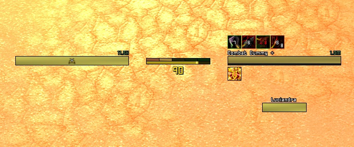

# SlyFox

## What is it

SlyFox is a lightweight and minimalistic energy and combopoint tracker addon for Wow TBC 2.4.3.
It also features energy tick tracking, bar smoothing and autohiding when out of combat with no target.

## How to configure

Currently there is no in-game config, so you will need to edit the SlyFox.lua file to change the trackers position and size. 
To do so, simply open the file in your favorite text editor, change what you want and save the file. Followed by a /run ReloadUI() in the games chat to load the changes!

## How to install

Go to Releases in https://github.com/nullfoxh/SlyFox/releases and download SlyFox.zip.  Extract it to your World of Warcraft/Interface/AddOns folder and you're done!  The path should be: World of Warcraft/Interface/AddOns/SlyFox/SlyFox.toc.

## Future plans

Once I'm done with my nameplate buffs addon, I'd like to make an in-game, CLI based config and possibly add aura bars for rupture, SnD and such.

## Latest changes - v1.1

* Fixed frame layers.
* Improved frame fading
* Frame will now fade out when dead

